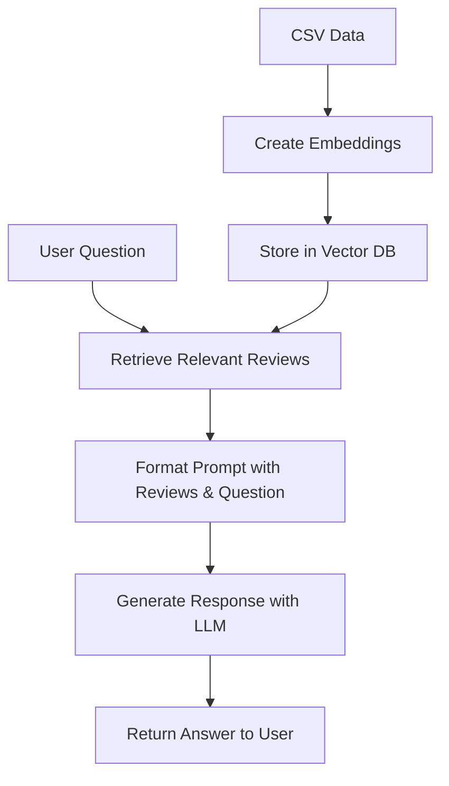

# Naruto Q&A Agent

A specialized question-answering agent for the Naruto anime/manga series, built using LangChain, Ollama, and ChromaDB. This agent uses advanced natural language processing to provide accurate and contextually relevant answers about the Naruto universe.

## Setup

1. Clone the repository:

   ```bash
   git clone https://github.com/swoyamsss/Naruto-qa-agent.git
   cd Naruto-qa-agent
   ```

2. Create and activate a virtual environment:

   ```bash
   # Windows
   python -m venv venv
   .\venv\Scripts\activate

   # Linux/Mac
   python3 -m venv venv
   source venv/bin/activate
   ```

3. Install dependencies:

   ```bash
   pip install langchain-ollama langchain-chroma langchain-core pandas
   ```

4. Install Ollama and required models:
   ```bash
   # Install Ollama from https://ollama.ai/
   # Then install the required models:
   ollama pull llama3.2
   ollama pull mxbai-embed-large
   ```

## Components

### 1. Data Storage (`vector.py`)

- **CSV Data**: Contains Naruto reviews with titles, dates, character information, ratings, and reviews
- **Vector Database**: Uses ChromaDB to store and retrieve document embeddings
- **Embedding Model**: Uses Ollama's mxbai-embed-large model to generate embeddings

### 2. Question Answering System (`Agent.py`)

- **Language Model**: Uses Ollama's llama3.2 model for generating responses
- **Prompt Template**: Structured template for formatting questions and context
- **Retrieval System**: Finds relevant reviews based on user questions

## How It Works

1. **Initialization**:

   - The system loads the Naruto reviews from the CSV file
   - Creates vector embeddings for each review using Ollama's embedding model
   - Stores these embeddings in a ChromaDB vector store

2. **User Interaction**:

   - User asks a question about Naruto
   - The system retrieves the 10 most relevant reviews using semantic search
   - These reviews are passed to the language model along with the question

3. **Response Generation**:
   - The language model processes the question and relevant reviews
   - Generates a comprehensive answer based on the provided context
   - Returns the answer to the user

## Flow Diagram



## Usage

1. Run the agent:

   ```bash
   python Agent.py
   ```

2. Ask questions about Naruto:
   - Type your question and press Enter
   - Type 'q' to quit

## Dependencies

- langchain-ollama
- langchain-chroma
- langchain-core
- pandas
- ollama (for running the language models)

## Note

Make sure you have Ollama installed and running with the required models (llama3.2 and mxbai-embed-large) before using this agent.

## Contributing

Contributions are welcome! Please feel free to submit a Pull Request.

## License

This project is open source and available under the MIT License.

## Author

- [Swoyam Siddharth Nayak](https://github.com/swoyamsss)
